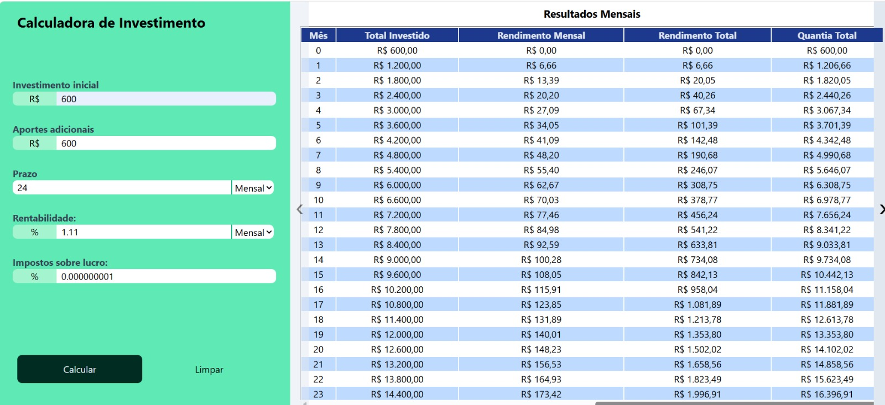

# 📈 Simulador de Investimentos


Aplicação web interativa para simular investimentos com aportes mensais, calculando rendimentos, impostos e projeções futuras. A ferramenta gera gráficos de evolução patrimonial (doughnut e barras) e tabelas detalhadas com dados mês a mês, utilizando JavaScript puro e Chart.js para visualização.


---

## ✨ Funcionalidades

- 📊 **Cálculo de projeções:** Simula investimentos com aporte inicial, contribuições mensais e taxa de retorno
- 🍩 **Gráfico de distribuição:** Doughnut com divisão entre investimento total, rendimento e impostos
- 📈 **Gráfico de evolução:** Barras empilhadas mostrando a progressão do investimento mês a mês
- 📋 **Tabela detalhada:** Dados mês a mês com valores formatados em moeda (R$)
- ✅ **Validação de formulário:** Feedback visual para dados inválidos
- 🧹 **Reset automático:** Limpeza de gráficos e tabelas ao recalcular
- 🎠 **Carrossel:** Alternância entre gráficos e tabela

---

## 🛠️ Tecnologias Utilizadas

| Tecnologia | Descrição |
|------------|-----------|
| **JavaScript Vanilla** | Lógica de cálculo e manipulação do DOM |
| **Chart.js** | Geração de gráficos interativos |
| **Tailwind CSS** | Estilização rápida e responsiva |
| **Vite** | Build rápido e desenvolvimento |
| **CSS Modules** | Estilização encapsulada (opcional) |

---

## 🧮 Como Funciona

### Cálculo Mês a Mês

O simulador calcula a evolução do investimento mês a mês usando a fórmula:

totalAmount = saldoAnterior * (1 + taxaRetorno) + contribuicaoMensal
rendimentoMensal = saldoAnterior * taxaRetorno
rendimentoAcumulado = totalAmount - totalInvestido


### Imposto sobre Rendimentos

O imposto é calculado sobre o rendimento total ao final do período:

imposto = rendimentoTotal * (taxaImposto / 100)
rendimentoLiquido = rendimentoTotal - imposto

---
## 📸 Capturas de Tela

### Desktop


### Mobile

---

## 📂 Estrutura do Projeto

calculadora-investimento/
├── src/
│ ├── main.js # Arquivo principal
│ ├── investimento.js # Lógica de cálculo
│ ├── table.js # Geração de tabelas
│ ├── style.css # Estilos globais
│ └── assets/ # Imagens e ícones
├── public/
│ └── desktopPerfil.png # Screenshot
├── index.html # HTML principal
├── package.json
└── README.md


---

## 🚀 Como Executar

```bash
# Clone o repositório
git clone https://github.com/AyrtonKarlosMarquesDeSena/CalculadoraDeInvestimento

# Acesse a pasta
cd calculadora-investimento

# Instale as dependências
npm install

# Rode o projeto
npm run dev

O projeto estará disponível em http://localhost:5173/.

---

Exemplo de Uso
Preencha os campos do formulário:

Investimento inicial (ex: R$ 1.000)

Aportes adicionais mensais (ex: R$ 100)

Prazo (ex: 12 meses)

Rentabilidade (ex: 1% ao mês)

Imposto sobre lucro (ex: 15%)

Clique em "Calcular" para visualizar:

Gráfico de distribuição final

Gráfico de evolução mensal

Tabela com detalhamento mês a mês

Clique em "Limpar" para resetar o formulário

---

const returnsArray = generateReturnsArray(
  startingAmount,      // Investimento inicial
  timeHorizon,         // Prazo
  timePeriod,          // "monthly" ou "yearly"
  monthlyContribution, // Contribuição mensal
  returnRate,          // Taxa de retorno
  returnTimeFrame      // "monthly" ou "yearly"
);

creatTable()
Cria uma tabela HTML dinâmica com os dados mês a mês.

javascript
creatTable(columnsArray, returnsArray, "results-table");

---

📬 Contato
Email: ayrtonsenna1432@gmail.com

LinkedIn: https://www.linkedin.com/in/ayrton-sena-0a1b5a349

GitHub: https://github.com/AyrtonKarlosMarquesDeSena?tab=repositories

Profile: https://ayrtondev.netlify.app/